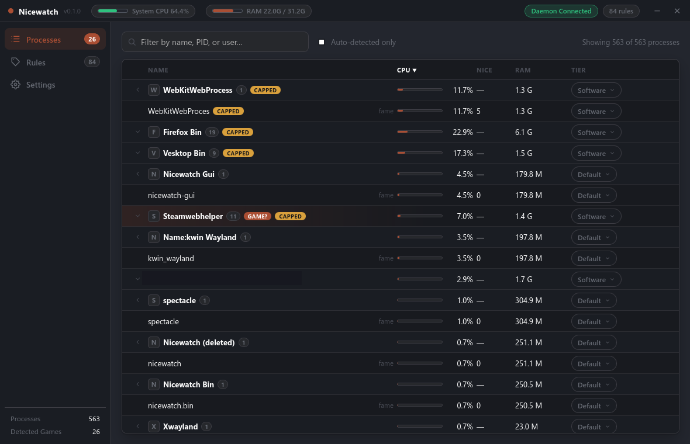

# Nicewatch

Nicewatch is a Linux CPU/IO priority manager: a Rust daemon that continuously
ranks running processes and applies the right `nice` / `ionice` (and optional
cgroup v2) values, paired with a Tauri v2 + Svelte 5 desktop app to observe
and control it live.

> **Status: experimental.** This project is AI-assisted software: it was
> written with the help of AI coding assistants and is used by the creator
> at the time this README was written. It may behave unexpectedly on systems
> other than the author's own. Tuning process priorities and cgroup limits
> can affect system responsiveness; you run it at your own risk and no
> warranty of any kind is provided. Prefer testing on a machine you can
> afford to reboot.

## Screenshot

<div align="center">
  
</div>

```
┌─────────────┐   rules.toml (system + local)   ┌──────────────┐
│   GUI app   │ ◄──────────────────────────────►│    daemon    │
│  (Tauri v2) │   UDS socket, diff-based JSON   │  (Rust, nix) │
└─────┬───────┘                                  └──────┬───────┘
      │ Tauri commands                                  │ setpriority/ioprio
      └──► Rust IPC client (own socket, reconnect loop) └────►  /proc scans
```
The GUI itself has zero privilege; all priority operations happen through the
daemon.  The daemon runs as root (so it can re-nice other users' processes),
takes config from `/etc/proc-priority-daemon/rules.toml`, and streams live
state to the GUI over a per-session Unix socket.

## Requirements

All of this is standard Linux plumbing — nothing exotic, but each piece is
load-bearing:

| component | why |
|---|---|
| **Linux + systemd** (any mainstream distro) | session cgroups, service management, and the runtime socket dir are all systemd conventions |
| **cgroup v2** (unified hierarchy, default since kernel 5.x / systemd 247) | `cpu.weight`, `cpu.max`, `memory.high` and `cpu.idle` are all cgroup v2 files.  Without it, the app degrades to nice/ionice only |
| **kernel >= 6.0** | `cpu.idle` (the idle class used to fully background apps) was added here; older kernels just skip idle rules |
| **root daemon** (recommended) | only root can *lower* nice values (e.g. Game tier -8), write the authoritative `/etc` config, and create cgroups anywhere.  Non-root still works: the daemon raises nice, manages cgroups delegated to the user session, and uses the local config |
| **Wayland session** (recommended) | the GUI is Tauri (X11 OK); nothing else requires Wayland — but desktop-session cgroups are the cleanest under a graphical systemd session |

How cgroup access works at runtime: the daemon discovers its base by probing
upward from its own cgroup to the first writable ancestor (never `/sys/fs/cgroup`
itself), which under a root install is `nicewatch.slice` and under a user
session is the delegated session subtree.  It creates per-app subgroups there,
writes (`cpu.weight`, `memory.high`, `cpu.idle`, `cpu.max`) to them, and moves
matching pids in; on exit or config change, pids are moved back to their
origin cgroup and empty subgroups are removed.  No udev rules, no raw chmod on
sysfs, no special kernel patches.

Also not required but worth knowing: the daemon doesn't need the `CAP_NICE`
setcap trick — as root it re-nices directly; `nice` values are only ever *set*,
never inherited from a higher-latency scheduler, and the `ionice` call goes
through the raw `ioprio_set` syscall (no `ionice` binary dependency).

## Tiers

Rules assign one of four tiers (pure `nice`/`ionice`, no SCHED_FIFO/RR):

| tier      | nice | ionice class | ionice priority | intent |
|-----------|------|--------------|-----------------|--------|
| Software  | 0    | best-effort  | 4               | default for everything |
| Game      | -8   | best-effort  | 2               | running games |
| Streaming | -10  | best-effort  | 1               | games + OBS |
| Realtime  | -12  | best-effort  | 0               | highest; de-facto rt that can't freeze the box |

## Detection heuristic

Fully automatic, no user approval required:

1. Process with `STEAM_COMPAT_DATA_PATH` / `SteamAppId` / `SteamGameId` in
   environ -> **Game** (a Steam game).
2. Process holding an fd on `/dev/dri/*` (but not a known compositor/DE) and
   running fullscreen (via `FullscreenDetector`; a no-op stub today, KWin
   D-Bus planned) -> **Game**.
3. If a **rule** in the config matches (exact `/proc/<pid>/comm`), the rule's
   tier wins over the heuristic — e.g. pin `VNyan` to Software even though its
   Steam prefix would flag it.
4. GUI shows a confirmation window ("Was `x` a game?" -> Yes / No / Not now).
   - **Yes** persists a Game rule for that process name.
   - **No** persists a Software rule.
   - **Not now** applies the Game tier to the running instance only and
     suppresses further prompts for that name until it fully exits.

Changes apply immediately and are persisted to the **local** config debounced
(1 s); the local file is then promoted to `/etc` once it has been stable for
`--promote-debounce-ms` (default 30 s), tracking both file mtimes.

## Repository layout

| crate | role |
|---|---|
| `common` | shared types: tiers, rules, IPC protocol (newline-delimited JSON over a Unix socket; first message full snapshot, then diffs) |
| `daemon` | the priority engine: `/proc` scanning, CPU% accounting, rules resolution, sync + promote, IPC server, ctrl-c reset |
| `gui` | Tauri v2 desktop app.  Svelte 5 (`$state` runes) + Vite.  Rust side owns the IPC socket with a 1 s reconnect loop and translates incoming `nw/hello`, `nw/snapshot`, `nw/diff` and `nw/prompt` daemon messages into Tauri events; the webview never touches the socket. |

Why Tauri + Svelte: a native tray/CLI would hide the point of the app
(live priority table), and Electron would double the memory for a monitor
utility.  Svelte 5's runes give reactive `$state` with no framework ceremony
for a single table view, and Tauri v2's Rust side keeps all the socket code
next to the daemon it talks to.

## Building

See `SETUP.md` for full install (systemd unit + icons + config dir).

```
cargo build --release
npm install --prefix gui
```

Daemon CLI:

```
nicewatch [--root-config PATH] [--local-config PATH] [--socket PATH]
          [--poll-ms MS] [--promote-debounce-ms MS] [--local-write-debounce-ms MS]
```

## Testing

```
cargo test -p nicewatch-common -p nicewatch-daemon
```

74 tests cover section parsing, rules/preset resolution, sync precedence
(newer-local wins, promote on settle, self-write mtime tolerance, EPERM
fallback), CPU% accounting, and the IPC wire format.

## Configuration

`rules.toml.example` documents every key.  Semantics:

- **precedence:** explicit rule > heuristic detection result > `auto_game_default` > software
- **authority:** `/etc` config is authoritative; a newer local file wins
  in-memory immediately and is then promoted to `/etc`.
- **promotion failures** (EPERM, read-only fs): warn once, keep running with
  the local rules.
- optional `[rules.x.cgroup]` block creates a cgroup v2 subtree and writes
  `cpu.weight` / `cpu_cap_percent` / `memory.high` / `cpu.idle` when the process
  appears.
  `cpu_cap_percent` is a hard throttle (percent of one core via `cpu.max`) —
  the only setting that genuinely caps CPU usage, editable live from the
  GUI's "Cap %" column.  The cap survives tier changes made afterwards.
  `cpu_idle = true` puts the group into the cgroup v2 *idle class*: its tasks
  only run when no non-idle task is runnable — stronger than a low
  `cpu_weight`, ideal for background apps.  Idle cgroups are pinned by the
  kernel to the minimum weight (cpu.weight writes return EINVAL), which the
  daemon skips for idle groups.
  `memory_high` is a soft memory ceiling that makes the kernel aggressively
  reclaim the group's inactive pages (to zram/swap) above the set value —
  useful to keep an idle desktop from hoarding RAM.  Set it above the app's
  live working set so active windows never thrash.
- Read-only GPU health notice: if any AMD GPU is pinned to
  `power_dpm_force_performance_level` = `low` (power-profiles-daemon or a
  stray write), the daemon broadcasts a one-shot warning (GUI banner + log)
  per "low" episode.  It never writes GPU state.

## Roadmap / gaps

- `FullscreenDetector` is a stub (always `true` on DRM/Steam flag) — wire up
  KWin via D-Bus, or X11 `_NET_WM_STATE_FULLSCREEN`.
- GUI live sort/filter is client-side today; long-term push sorting to the
  daemon and only ship deltas.
- ioprio currently goes through `/proc/self/ioprio` via raw `ioprio_set`
  syscall; a THREAD-level cgroup (nicewatch.slice) remains on the roadmap.
- Nothing here launches games or manages Steam; it only ranks processes.